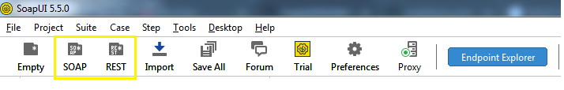
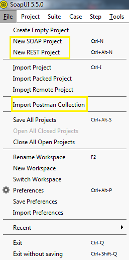
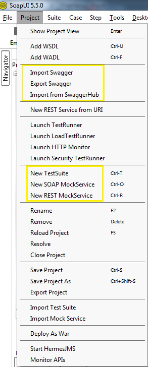
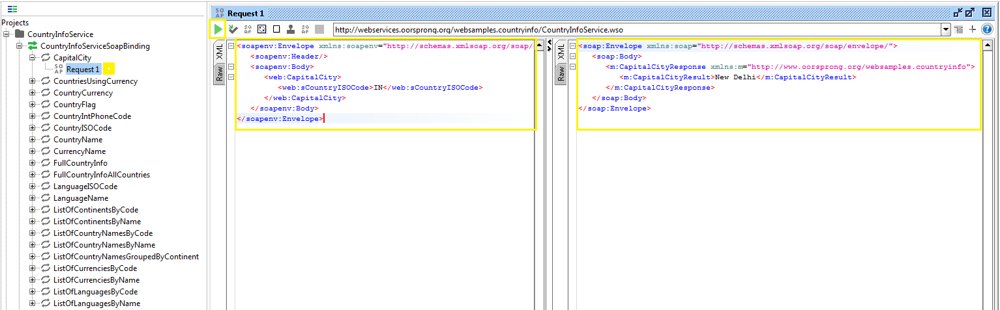
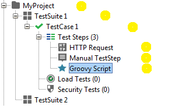
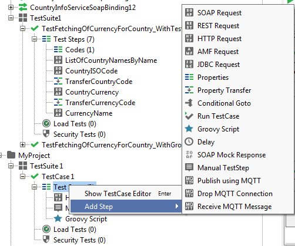
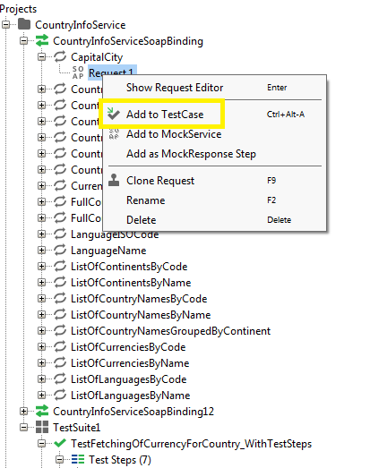

# SoapUI

SoapUI is a tool to automate testing of Webservices(**API testing**) which are either SOAP based or Restful based

## SoapUI editons

**Community edition** - Free tool

**Pro editon** - Paid with advance features

## Installation

Download and install from their website - https://www.soapui.org/downloads/soapui.html

## Creating a project

You can directly create a new project based on a WSDL(SOAP) based url or a WADL based uri.

This will create a project and add all the web request methods available in the description for us to test.

Furthermore, you can also import tests from a Postman collections project from the File menu

	

In additon to that, it also has options to import/export a Swagger definition you can check them in the Project menu

	

## Testing the service

Once the project is created with the URL, SoapUI automaticalliy adds all the available web service or api methods like below

You can play around the different web service methods with different inputs in the request and check the response from the server

## Project hierarchy

There are three levels in your test project

- [X] **TestSuite** - Contains a logical grouping of test cases like for e.g. SmokeTest, RegressionTest, SystemTest

- [X] **TestCases** - Contains a collection of test steps which describes a scenario to be tested

- [X] **TestSteps** - A request or step or action

## Properties

Below are the levels at which you can add properties as key value pairs:

- [X] **Global properties**

- [X] **Project properties**

- [X] **Testsuite properties**

- [X] **Testcase properties**

## Testcases and teststeps

Add test steps in test cases

Add test steps from request/response section

## Assertions

### String

### XPath

### SLA

## Passing values to steps

Values can be passed from one step to another through a property transfer step

## Adding, Modifying properties

## Authentication and authorization

## Loops, Datasource and Datasinks

## Database connection

## Groovy scripts

## Mock servers
